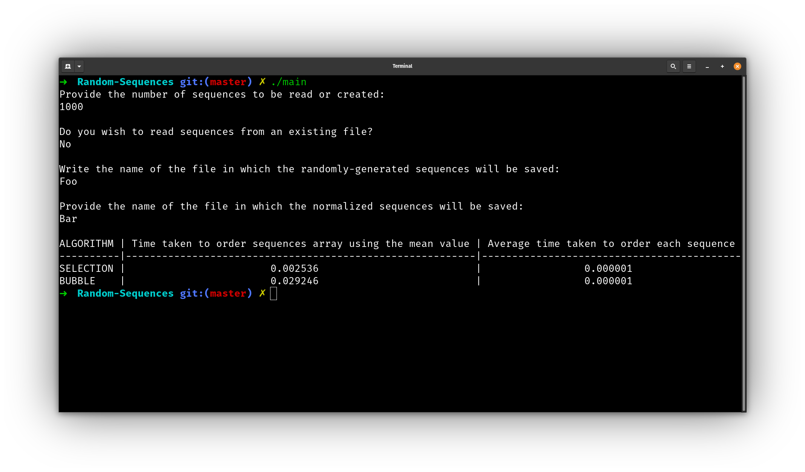
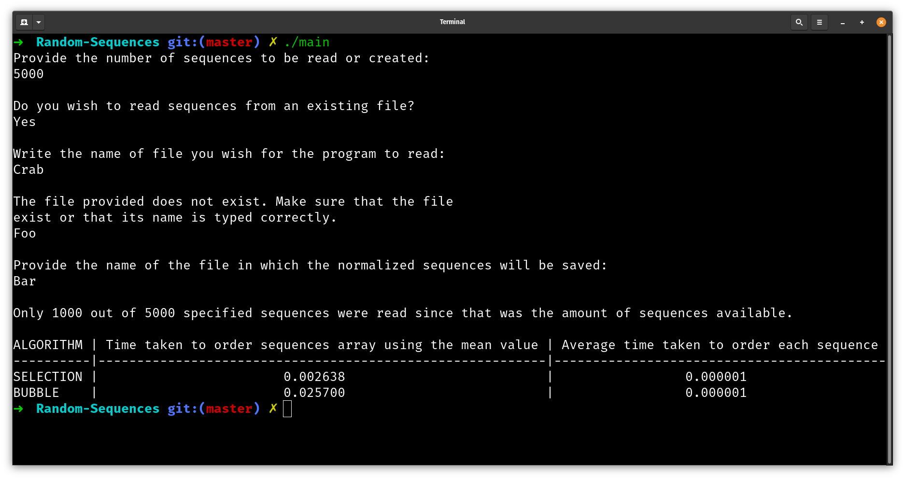
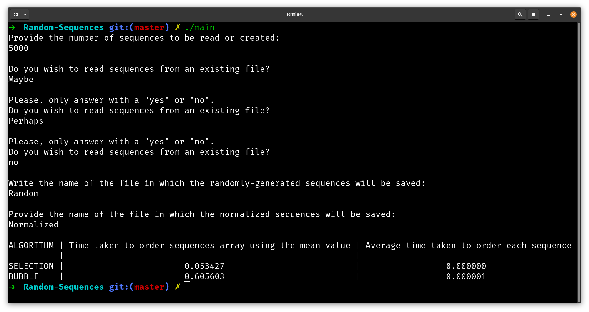

# Introduction
This program takes a file of randomly generated sequences and processess them, or creates a new file of randomly generated sequences in order to process it. During the processing phase the program will normalize the sequences, find the mean value, find the standard deviation and sorts them using the Selection Sort and Bubble Sort algorithms.

<p align="center">
    
</p>

# Index
- [About](#About)
- [Usage](#Usage)
- [Resources](#Resources)
- [Gallery](#Gallery)

# About
This program served as an introductory exercise for practicing use of programming concepts such as Object-Oriented Programming (the Sequence struct, its members and methods), Abstract Data Types (as seen in the implementation of a Sequence, a collection of elements inside a vector) and algorithms and their computational complexity, given by the employed Selection Sort and Bubble Sort algorithms. As well as the aforementioned concepts, other software-developing activities, such as version control using Git, were starting to be put into practice here.

This started as a group class project that was then continued independently.

# Usage
## Unix-based
In order to user the program, simply download the repository and compile the .cpp files. A command like this should work, assuming g++ is available in a Unix-based system:
```
g++ -g main.cpp Sequence.cpp -o <executable filename>
```
Then run the program by typing:
```
./main
```

## Windows
If MingGW is installed on a Windows-based system, the above command should work except that the executable extension must be `.exe`. For example, in Powershell:
```
g++ -g main.cpp Sequence.cpp -o <filename>.exe
```
should work, assuming the directory where `g++.exe` resides in is added to the path.

Then, to run the program, simply type:
```
.\main.exe
```

# Resources
- [Selection Sort Algorithm](https://en.wikipedia.org/wiki/Selection_sort)
- [Bubble Sort Algorithm](https://en.wikipedia.org/wiki/Bubble_sort#:~:text=Bubble%20sort%2C%20sometimes%20referred%20to,until%20the%20list%20is%20sorted.)

# Gallery





