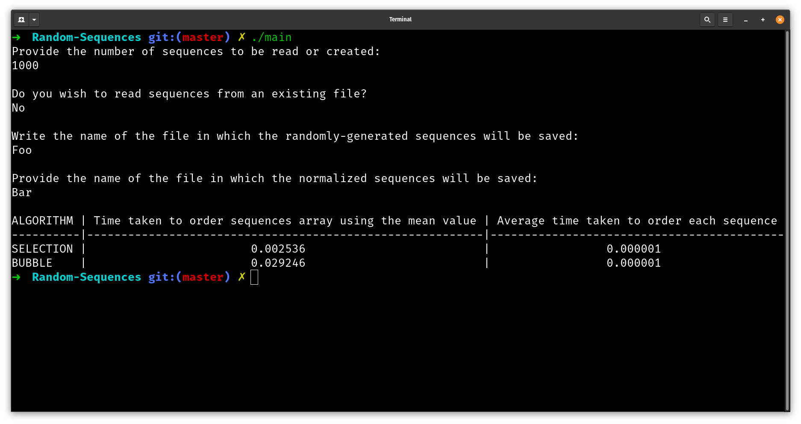

# Introduction

This program takes a file of randomly generated sequences and processess them, or creates a new file of randomly generated sequences in order to process it. During the processing phase the program will normalize the sequences, find the mean value, find the standard deviation and sorts them using the Selection Sort and Bubble Sort algorithms.

# Index
- [About](#About)
- [Usage](#Usage)
- [Resources](#Resources)
- [Gallery](#Gallery)
- [Licence](#Licence)

# About
This is one of my first 'major' projects (back then as a programming débutant), in which I implemented concepts learned in Computer Science classes such as Abstract Data Types, classes, objects, implementing basic sorting algorithms, etc. while also learning how to use git to track and version changes. While it being a small, harmless project, I learned a lot from it and serves as a reference point to how far I've come from when I first started to learn about programming and Computer Science with projects like this.

This started as a group class project but was then continued independently.

# Usage
In order to user the program, simply download the repository and compile the *.cpp files. A command like this should work, assuming g++ is available in an Unix-based system:
```
g++ -g main.cpp Sequences.cpp -o <executable filename>
```

If MingGW is installed on a Windows-based system, the above command should work except the executable extension must be `.exe`.


# Resources
- [Selection Sort Algorithm](https://en.wikipedia.org/wiki/Selection_sort)
- [Bubble Sort Algorithm](https://en.wikipedia.org/wiki/Bubble_sort#:~:text=Bubble%20sort%2C%20sometimes%20referred%20to,until%20the%20list%20is%20sorted.)

# Gallery

<p>
    
</p>
